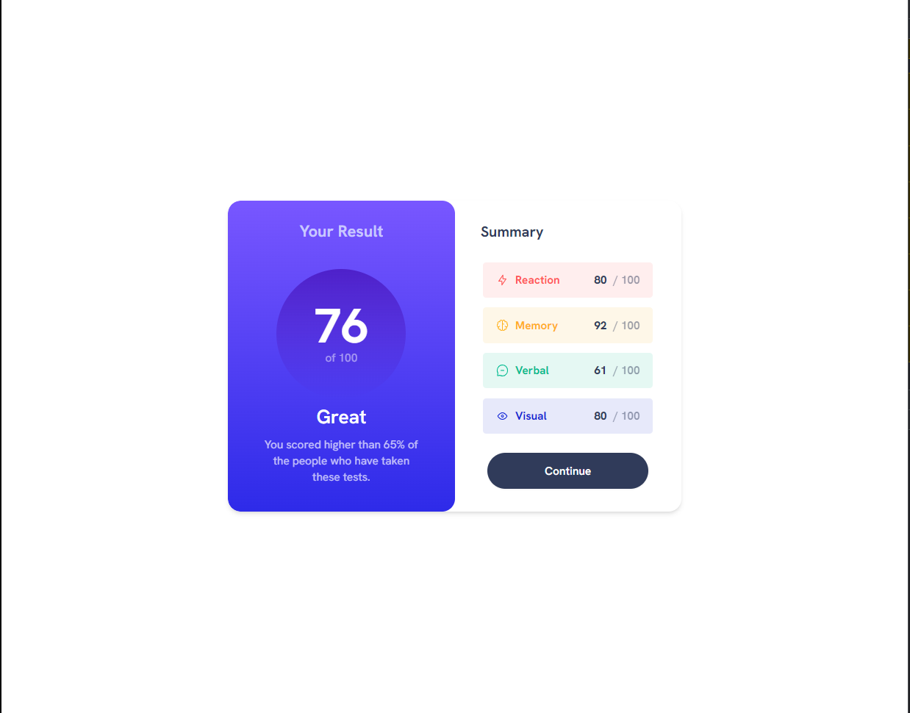

# Frontend Mentor - Results summary component solution

This is my solution to the [Results summary component challenge on Frontend Mentor](https://www.frontendmentor.io/challenges/results-summary-component-CE_K6s0maV). Frontend Mentor challenges help you improve your coding skills by building realistic projects.

## Table of contents

- [Overview](#overview)
  - [The challenge](#the-challenge)
  - [Screenshot](#screenshot)
  - [Links](#links)
- [My process](#my-process)
  - [Built with](#built-with)
  - [What I learned](#what-i-learned)
  - [Continued development](#continued-development)
  - [Useful resources](#useful-resources)
- [Author](#author)

## Overview

### The challenge

Users should be able to:

- View the optimal layout for the interface depending on their device's screen size
- See hover and focus states for all interactive elements on the page
- **Bonus**: Use the local JSON data to dynamically populate the content - (I haven't done this yet)

### Screenshot

### Links

- Solution URL: [Add solution URL here](https://your-solution-url.com)

## My process

### Built with

- [React](https://reactjs.org/) - JS library
- [Next.js](https://nextjs.org/) - React framework
- [Tailwind](https://tailwindcss.com/) - For styles

### What I learned

This challenge involved a fair amount of tweaking spacing and getting a layout just right. The Summary data on the right hand side of the component had many elements that needed to be spaced out according to a particular design. Using Tailwind CSS, I accomplished this layout with a variety of flex boxes.
To see how you can add code snippets, see below:

### Continued development

The next steps here would be to add the react functionality to render the summary data items as a list, with dynamic classes.

### Useful resources

- [Tailwind CSS Docs](https://tailwindcss.com/docs/installation) - Tailwind's docs were my primary guide in getting the styles and layouts correct.

## Author

- Website - [Austin Johnson](https://www.austinjohnson.me)
- Frontend Mentor - [@AgenticAI](https://www.frontendmentor.io/profile/AgenticAI)
- Twitter - [@AustonianAI](https://twitter.com/AustonianAI)
